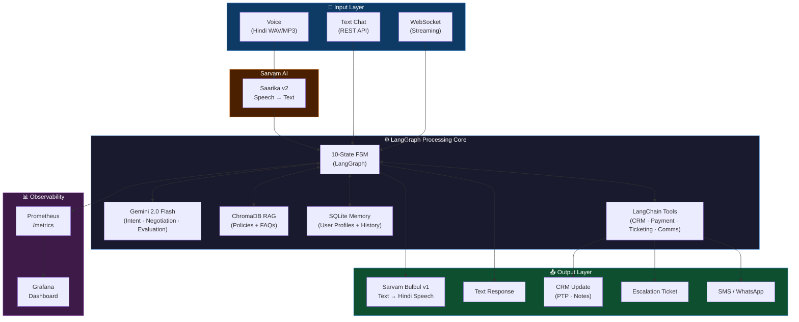
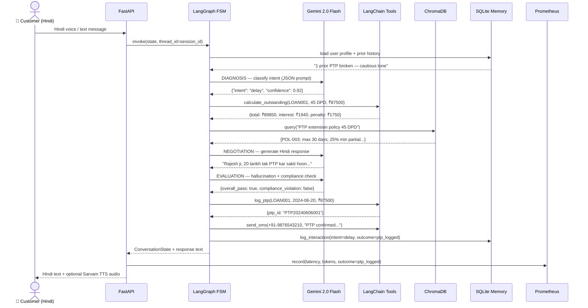
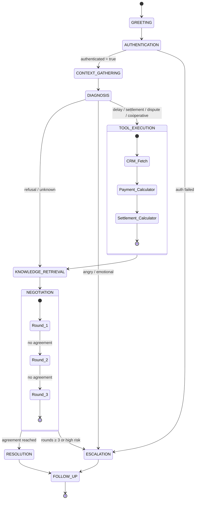
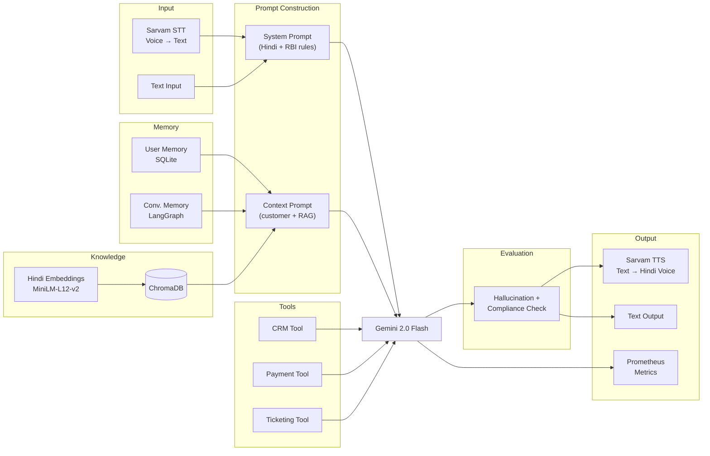
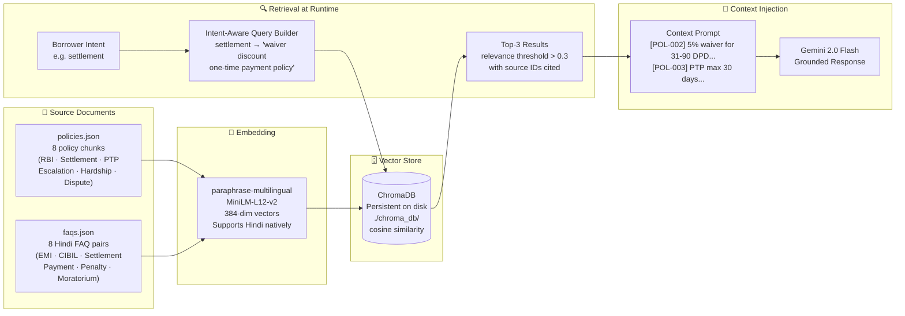
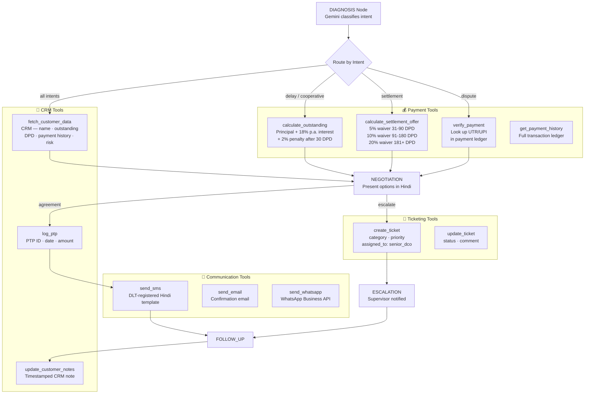
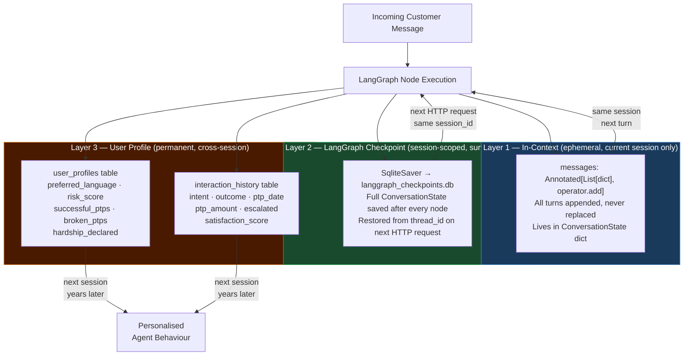
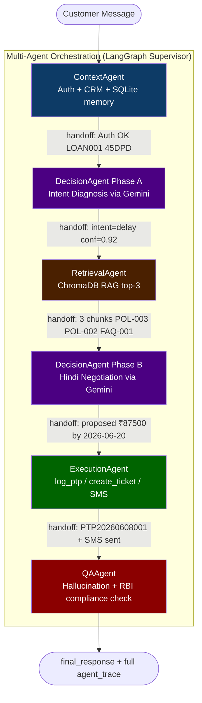

# CredResolve DCO Agent

> **An end-to-end agentic AI system** — Hindi Debt Collection Officer powered by  
> LangGraph · Multi-Agent Supervisor · ChromaDB RAG · Sarvam AI Voice · Gemini 2.5 Flash · FastAPI · Prometheus

## 🔗 Links

- **🚀 Live Demo:** https://credresolve-production.up.railway.app/
- **📓 NotebookLM (project notebook):** https://notebooklm.google.com/notebook/7d9da0a3-341a-4a8f-9bf5-71bb8967a1a4

---

## Table of Contents

1. [What This System Does](#1-what-this-system-does)
2. [Technology Stack & Why Each Was Chosen](#2-technology-stack--why-each-was-chosen)
3. [System Architecture](#3-system-architecture)
4. [Part 1 — State Machine Design](#4-part-1--state-machine-design)
5. [Part 2 — Workflow Design (LangFlow)](#5-part-2--workflow-design-langflow)
6. [Part 3 — Prompt Engineering](#6-part-3--prompt-engineering)
7. [Part 4 — Voice AI (Hindi)](#7-part-4--voice-ai-hindi)
8. [Part 5 — Knowledge Base & RAG](#8-part-5--knowledge-base--rag)
9. [Part 6 — Tool Calling](#9-part-6--tool-calling)
10. [Part 7 — Memory & Context Persistence](#10-part-7--memory--context-persistence)
11. [Part 8 — Observability & Monitoring](#11-part-8--observability--monitoring)
12. [Part 9 — Hindi Debt Collection Use Case](#12-part-9--hindi-debt-collection-use-case)
13. [Part 10 — Multi-Agent System (Bonus)](#13-part-10--multi-agent-system-bonus)
14. [Project Structure](#14-project-structure)
15. [Setup & Installation](#15-setup--installation)
16. [API Reference](#16-api-reference)
17. [Docker Deployment](#17-docker-deployment)
18. [LangFlow Import Guide](#18-langflow-import-guide)
19. [Free Gemini Tier Limits](#19-free-gemini-tier-limits)
20. [Evaluation Criteria Mapping](#20-evaluation-criteria-mapping)
21. [Troubleshooting](#21-troubleshooting)

---

## 1. What This System Does

CredResolve DCO Agent is a **production-ready, multi-step agentic AI system** that acts as a Hindi-speaking Debt Collection Officer (DCO) named **Arya**. The agent:

- Initiates and holds **multi-turn conversations in Hindi/Hinglish** with borrowers
- Follows a strict **10-state finite state machine** governed by LangGraph
- **Classifies borrower intent** (delay / refusal / dispute / settlement / angry) using Gemini
- **Retrieves live policy guidance** from ChromaDB using Retrieval-Augmented Generation
- **Calls 4 external tool categories** — CRM, Ticketing, Payment Calculator, Communications
- **Persists memory** across sessions — improving its approach on return calls
- **Speaks and listens in Hindi** via Sarvam AI (India's best Hindi voice AI)
- **Logs all activity** to Prometheus metrics for business and technical monitoring
- **Complies with RBI Fair Practices Code** — never harasses, always escalates when needed
- **Runs as a 5-specialist multi-agent system** (Bonus) — Context → Retrieval → Decision → Execution → QA agents, each with a narrow role and full agent-to-agent trace

---

## 2. Technology Stack & Why Each Was Chosen

| Layer | Technology | Version | Reason for Choice |
|-------|-----------|---------|------------------|
| **Agent Framework** | LangGraph | ≥0.1.0 | Native finite state machine with Python code nodes, SQLite checkpointing, and conditional edge routing. Chosen over plain LangChain agents because it gives explicit control over state transitions — critical for compliance-heavy debt collection workflows. |
| **Workflow Orchestration** | LangFlow | ≥1.0.0 | Visual drag-and-drop workflow builder that exports/imports JSON. Used to visualise the pipeline for non-technical stakeholders. LangFlow is preferred over n8n here because it is Python-native and integrates directly with LangChain components. |
| **LLM** | Gemini 2.5 Flash | gemini-2.5-flash | Google's free-tier model (GA June 2026) — thinking capabilities, excellent Hindi reasoning and JSON-structured output. Chosen over OpenAI/Claude for zero cost during development and demo. |
| **RAG / Vector Store** | ChromaDB | ≥0.5.0 | Embedded vector database — runs fully on-disk, no server required. Ideal for a demo that must work locally. Stores policy documents and FAQs with cosine similarity search. |
| **Embeddings** | paraphrase-multilingual-MiniLM-L12-v2 | sentence-transformers | Supports Hindi natively — encodes Devanagari text into meaningful vectors. Free and runs locally with no API calls. |
| **Voice STT** | Sarvam AI — Saarika v2 | API | India's purpose-built Hindi STT model. Outperforms Whisper on Hindi/Hinglish because it was trained on Indian speech data including accented Hindi and code-switching. |
| **Voice TTS** | Sarvam AI — Bulbul v1 | API | Natural-sounding Hindi TTS with female voice "Meera". Also supports ElevenLabs multilingual v2 as a fallback for higher expressiveness. |
| **Backend API** | FastAPI | ≥0.111.0 | Async Python framework with WebSocket support for real-time streaming conversations. Auto-generates OpenAPI docs at `/docs`. |
| **User Memory** | SQLite via SQLAlchemy | built-in | Zero-infrastructure persistent storage for cross-session user profiles. Stores interaction history, PTP records, and risk scores. |
| **Graph Memory** | LangGraph SqliteSaver | built-in | Persists the full LangGraph state (all messages, variables) per `thread_id` across HTTP requests. |
| **Monitoring** | Prometheus + Grafana | latest | Industry-standard metrics stack. FastAPI exposes `/metrics`; Prometheus scrapes it; Grafana dashboards visualise business KPIs and technical metrics. |
| **Containerisation** | Docker + Docker Compose | latest | Single `docker-compose up --build` starts the API, Prometheus, and Grafana together. |

---

## 3. System Architecture



### Single-Call Data Flow



---

## 4. Part 1 — State Machine Design

**Files:** [backend/agent/state_machine.py](backend/agent/state_machine.py) · [backend/agent/graph.py](backend/agent/graph.py) · [architecture/state_machine.md](architecture/state_machine.md)



### State Reference Table

| # | State | Entry Condition | Key Actions | Exit Condition |
|---|-------|----------------|-------------|----------------|
| 1 | **GREETING** | New session started | Introduce Arya in Hindi | Greeting delivered |
| 2 | **AUTHENTICATION** | Greeting done | Verify Loan ID via CRM tool | CRM record found |
| 3 | **CONTEXT_GATHERING** | Auth passed | Load CRM data + SQLite memory | Customer profile loaded |
| 4 | **DIAGNOSIS** | Context loaded | LLM classifies intent via JSON prompt | Intent + confidence score returned |
| 5 | **TOOL_EXECUTION** | Intent ∈ {delay, settlement, dispute, cooperative} | Call CRM / payment / verification tools | Tool results returned |
| 6 | **KNOWLEDGE_RETRIEVAL** | Tools done | RAG query to ChromaDB for policies | ≥1 relevant document (score > 0.3) |
| 7 | **NEGOTIATION** | Policies retrieved | Present options in Hindi; track rounds (max 3) | Agreement OR round limit reached |
| 8 | **ESCALATION** | intent=angry OR auth fail OR DPD>90 | Create ticket, notify supervisor | Ticket created |
| 9 | **RESOLUTION** | Customer agrees | log_ptp(), send_sms(), update CRM | PTP/settlement logged |
| 10 | **FOLLOW_UP** | Resolution or escalation done | Write to SQLite memory, close session | Session ends |

### ConversationState TypedDict (the agent's full memory for one session)

```python
class ConversationState(TypedDict, total=False):
    messages: Annotated[List[dict], operator.add]  # appended, never replaced
    session_id: str
    customer_id: Optional[str]
    customer_data: Optional[dict]        # loaded from CRM
    authenticated: bool
    intent: Optional[str]                # delay/refusal/dispute/settlement/angry
    intent_confidence: float
    retrieved_policies: Optional[List[str]]   # from ChromaDB
    tool_results: Optional[dict]         # from CRM/payment tools
    negotiation_rounds: int
    proposed_amount: Optional[float]
    proposed_date: Optional[str]
    ptp_logged: bool
    escalation_required: bool
    resolution_outcome: Optional[str]
    token_usage: int                     # cumulative for session
    tool_call_count: int
```

---

## 5. Part 2 — Workflow Design (LangFlow)

**File:** [langflow/workflow.json](langflow/workflow.json)

LangFlow provides a visual representation of the pipeline. Load it with:

```bash
pip install langflow
langflow run
# Open http://localhost:7860 → Import → langflow/workflow.json
```



> **LangFlow vs LangGraph:** LangFlow is used to *visualise and communicate* the pipeline. LangGraph (`backend/agent/graph.py`) is the *actual runtime* — it provides checkpointing, conditional edges, and state persistence that the LangFlow UI represents but cannot fully execute.

---

## 6. Part 3 — Prompt Engineering

**Files:** [backend/prompts/](backend/prompts/)

### Prompt 1 — System Prompt (`system_prompt.py`)
Defines Arya's personality, constraints, and RBI compliance rules. Injected as `SystemMessage` on every LLM call.

```
आप CredResolve के एक विनम्र और पेशेवर ऋण संग्रह अधिकारी (DCO) हैं।
आपका नाम "आर्या" है।

## RBI दिशानिर्देश (अनिवार्य)
- सुबह 8 बजे से पहले या रात 7 बजे के बाद संपर्क न करें।
- उधारकर्ता को अपमानित या परेशान न करें।
- तीसरे पक्ष को ऋण की जानकारी न दें।
- यदि "मुझे परेशान मत करो" कहे → तुरंत बातचीत समाप्त करें।

## एस्केलेशन नियम — तुरंत escalate करें:
- 90+ DPD + कोई विकल्प नहीं माना
- कानूनी धमकी मिली
- ग्राहक भावनात्मक संकट में
```

**Design rationale:** Embedding compliance rules in the system prompt (not just the knowledge base) ensures they apply on every LLM call, not just when RAG retrieves a policy document.

### Prompt 2 — Context Prompt (`context_prompt.py`)
Injects live customer data and retrieved policies per request.

```
## ग्राहक जानकारी
- नाम: Rajesh Kumar | ऋण ID: LOAN001
- बकाया: ₹87,500 | देरी: 45 दिन | Risk: Medium

## पुनः प्राप्त नीतियां (RAG)
- [POL-002] 31-90 DPD पर 5% छूट के साथ FFS संभव...
- [POL-003] PTP अधिकतम 30 दिन तक...

## बातचीत इतिहास: कुल 2 | पिछला PTP टूटा: हां
```

### Prompt 3 — Reasoning Prompt (`reasoning_prompt.py`)
Forces chain-of-thought via structured JSON output for two critical decisions:

**Intent Classification output:**
```json
{ "intent": "delay", "confidence": 0.92,
  "reasoning": "ग्राहक ने 'अगले हफ्ते' कहा",
  "suggested_response_strategy": "PTP schedule करें" }
```

**Negotiation Reasoning output:**
```json
{ "recommended_option": "ptp", "proposed_amount": 87500,
  "proposed_date": "2024-06-20",
  "hindi_pitch": "Rajesh ji, 20 tarikh tak PTP kar sakti hoon...",
  "escalate_reason": null }
```

### Prompt 4 — Evaluation Prompt (`evaluation_prompt.py`)
A second Gemini call after every response — acts as a programmatic QA gate:

```json
{ "hallucination_detected": false, "hallucinated_claims": [],
  "compliance_violation": false, "violation_details": null,
  "accuracy_score": 0.97, "tone_score": 0.95,
  "overall_pass": true, "corrected_response": null }
```

If `overall_pass` is `false`, the corrected response replaces the original before delivery.

---

## 7. Part 4 — Voice AI (Hindi)

**Files:** [backend/voice/sarvam_voice.py](backend/voice/sarvam_voice.py) · [backend/voice/elevenlabs_voice.py](backend/voice/elevenlabs_voice.py)

### Sarvam AI (Primary)

| Model | Endpoint | Purpose |
|-------|---------|---------|
| Saarika v2 | `/speech-to-text` | Hindi/Hinglish speech → text |
| Bulbul v1 | `/text-to-speech` | Text → natural Hindi audio (speaker: meera) |
| Mayura v1 | `/translate` | Hindi ↔ English when borrower code-switches |

```bash
# STT request (WAV audio → Hindi transcript)
POST https://api.sarvam.ai/speech-to-text
{ "model": "saarika:v2", "language_code": "hi-IN", "audio": "<base64>" }
# → {"transcript": "मुझे अगले हफ्ते तक का समय चाहिए"}

# TTS request (Hindi text → WAV audio)
POST https://api.sarvam.ai/text-to-speech
{ "inputs": ["नमस्ते! मैं आर्या हूं।"], "speaker": "meera",
  "target_language_code": "hi-IN", "model": "bulbul:v1" }
# → {"audios": ["<base64-wav>"]}
```

### ElevenLabs (Fallback for emotional expressiveness)
Uses `eleven_multilingual_v2` model which supports Hindi. Used in escalation/de-escalation scenarios where a warmer voice tone improves borrower response.

### Voice Endpoints

| Endpoint | Method | Purpose |
|----------|--------|---------|
| `/voice/transcribe` | POST | Upload audio → get Hindi transcript |
| `/chat` with `voice_enabled=true` | POST | Get text + TTS audio URL in response |
| `/ws/{session_id}` | WebSocket | Send `voice_audio` base64 → get transcript + reply |

---

## 8. Part 5 — Knowledge Base & RAG

**Files:** [backend/rag/knowledge_base.py](backend/rag/knowledge_base.py) · [backend/rag/retriever.py](backend/rag/retriever.py)



### Knowledge Base Contents

| ID | Category | Content Summary |
|----|----------|----------------|
| POL-001 | Compliance | RBI Fair Practices Code — contact hours, no harassment, no third-party disclosure |
| POL-002 | Settlement | 5% waiver (31-90 DPD) · 10% (91-180 DPD) · 20% (181+ DPD) |
| POL-003 | PTP | Max 30-day extension · 25% min partial · 2 broken PTPs → escalate |
| POL-004 | Escalation | Conditions for supervisor handoff |
| POL-005 | Hardship | 3-month moratorium for job loss / medical emergency |
| POL-006 | Dispute | 48-hour payment verification SLA |
| FAQ-000..007 | FAQ | 8 Hindi Q&A pairs: EMI, CIBIL, settlement, payment, penalty |

### Intent-Aware Query Design
Rather than using the raw user message, the retriever builds a targeted query:

```python
intent_queries = {
    "settlement": "settlement discount waiver one-time payment policy",
    "delay":      "PTP promise to pay extension policy guidelines",
    "dispute":    "payment dispute resolution UTR verification process",
    "angry":      "RBI fair practices code harassment escalation borrower rights",
    "refusal":    "restructuring EMI hardship moratorium options",
}
```

---

## 9. Part 6 — Tool Calling

**Files:** [backend/tools/](backend/tools/)



### Tool Reference

| Category | Function | When Called | Example Output |
|----------|----------|-------------|---------------|
| **CRM** | `fetch_customer_data(loan_id)` | AUTHENTICATION | `{outstanding: 87500, DPD: 45, risk: "Medium"}` |
| **CRM** | `log_ptp(loan_id, date, amount)` | RESOLUTION | `{ptp_id: "PTP20240606001"}` |
| **CRM** | `update_customer_notes(loan_id, note)` | FOLLOW_UP | `{status: "success"}` |
| **Payment** | `calculate_outstanding(loan_id, DPD, principal)` | TOOL_EXECUTION | `{total: 89850, interest: 1940, penalty: 1750}` |
| **Payment** | `calculate_settlement_offer(loan_id, outstanding, DPD)` | TOOL_EXECUTION | `{options: [{label: "Early", waiver: 5%, amount: 83125}]}` |
| **Payment** | `verify_payment(loan_id, txn_id)` | TOOL_EXECUTION (dispute) | `{status: "found", txn: {amount: 12000, status: "unverified"}}` |
| **Ticketing** | `create_ticket(loan_id, category, priority, desc)` | ESCALATION | `{ticket_id: "TKT-A1B2C3D4"}` |
| **Ticketing** | `update_ticket(ticket_id, status, comment)` | Follow-up | `{status: "success"}` |
| **Comms** | `send_sms(phone, message)` | RESOLUTION | `{msg_id: "SMS-20240606103000"}` |
| **Comms** | `send_email(to, subject, body)` | FOLLOW_UP | `{msg_id: "EMAIL-20240606103001"}` |
| **Comms** | `send_whatsapp(phone, message)` | Optional | `{msg_id: "WA-20240606103002"}` |

---

## 10. Part 7 — Memory & Context Persistence

**Files:** [backend/memory/user_memory.py](backend/memory/user_memory.py) · [backend/memory/conversation_memory.py](backend/memory/conversation_memory.py)



### Memory in Action — First vs Second Call

**First call:**
```
Memory summary: "पहली बातचीत — कोई पूर्व इतिहास नहीं।"
Agent behaviour: Standard greeting, neutral negotiation tone.
```

**Second call (same customer, one week later, PTP was broken):**
```
Memory summary:
"कुल बातचीत: 1 | सफल PTP: 0 | टूटे PTP: 1
[2024-06-06] Intent=delay, Outcome=ptp_logged, PTP=2024-06-13 — BROKEN"

Agent behaviour:
→ References broken PTP directly
→ Skips another PTP offer
→ Pushes settlement instead
→ Escalates faster if refused
```

---

## 11. Part 8 — Observability & Monitoring

**File:** [backend/monitoring/metrics.py](backend/monitoring/metrics.py)

All metrics exposed at `GET /metrics` in Prometheus exposition format.

### Complete Metrics Reference

| Metric | Type | Labels | Measures |
|--------|------|--------|---------|
| `dco_conversations_total` | Counter | `channel`, `language` | Total conversations by channel and language |
| `dco_conversation_duration_seconds` | Histogram | — | Full call duration distribution |
| `dco_llm_latency_ms` | Histogram | — | Gemini response time per call |
| `dco_token_usage_total` | Counter | `model`, `direction` | Input/output tokens consumed |
| `dco_cost_usd_total` | Counter | `model` | Estimated USD spend (zero on Gemini free tier) |
| `dco_active_sessions` | Gauge | — | Open WebSocket connections right now |
| `dco_resolution_outcome_total` | Counter | `outcome` | ptp_logged / settlement_agreed / escalated / dispute_raised |
| `dco_escalations_total` | Counter | `reason` | Escalations by trigger reason |
| `dco_ptp_amount_inr` | Histogram | — | PTP commitment amounts (cash flow forecasting) |
| `dco_intent_detected_total` | Counter | `intent` | Borrower intent distribution |
| `dco_rag_latency_ms` | Histogram | — | ChromaDB query time |
| `dco_rag_retrieved_docs` | Histogram | — | Docs passing 0.3 relevance threshold per query |
| `dco_hallucination_total` | Counter | — | Responses flagged by evaluation prompt |
| `dco_tool_calls_total` | Counter | `tool_name`, `status` | Tool call success/failure rate |
| `dco_state_transitions_total` | Counter | `from_state`, `to_state` | FSM transition heatmap |

### Key Grafana PromQL Panels

```promql
# Resolution Rate
sum(dco_resolution_outcome_total{outcome=~"ptp_logged|settlement_agreed"})
/ sum(dco_conversations_total) * 100

# Escalation Rate
sum(dco_escalations_total) / sum(dco_conversations_total) * 100

# P95 LLM Latency
histogram_quantile(0.95, rate(dco_llm_latency_ms_bucket[5m]))

# Daily Token Cost
increase(dco_cost_usd_total[24h])

# Hallucination Rate
rate(dco_hallucination_total[1h]) / rate(dco_conversations_total[1h])
```

---

## 12. Part 9 — Hindi Debt Collection Use Case

**Data:** [data/sample_customers.json](data/sample_customers.json)

### Pre-loaded Test Customers

| Loan ID | Name | Outstanding | DPD | Demo Scenario |
|---------|------|------------|-----|--------------|
| LOAN001 | Rajesh Kumar | ₹87,500 | 45 | Delay · Refusal · Settlement · Angry |
| LOAN002 | Priya Sharma | ₹19,50,000 | 3 | Cooperative (early stage) |
| LOAN003 | Mohammed Ali | ₹3,20,000 | 95 | Dispute (claims payment made) |

---

### Scenario 1 — Payment Delay

**Borrower:** "मुझे अगले हफ्ते तक का समय चाहिए, salary आती ही pay कर दूंगा।"

```
FSM Path:
GREETING → AUTHENTICATION(LOAN001) → CONTEXT_GATHERING
→ DIAGNOSIS [intent=delay, confidence=0.92]
→ TOOL_EXECUTION
    calculate_outstanding(LOAN001, 45, 87500) → ₹89,850 total
→ KNOWLEDGE_RETRIEVAL
    RAG: "POL-003 — PTP max 30 days, 25% min partial..."
→ NEGOTIATION
    Gemini: "Rajesh ji, main 20 tarikh tak ka PTP schedule kar sakti hoon.
             ₹87,500 ka bhugtan karna hoga. Kya 20 theek rahega?"
→ RESOLUTION [customer agrees]
    log_ptp(LOAN001, 2024-06-20, 87500) → PTP20240606001
    send_sms → "PTP confirmed: ₹87,500 by 20-Jun"
→ FOLLOW_UP
    SQLite: log_interaction(intent=delay, outcome=ptp_logged)
    CRM: note appended
```

---

### Scenario 2 — Refusal to Pay

**Borrower:** "मेरे पास पैसे नहीं हैं। आप जो करना है करो।"

```
FSM Path:
... → DIAGNOSIS [intent=refusal]
→ KNOWLEDGE_RETRIEVAL (no tool execution — need policy first)
    RAG: "POL-005 — 3-month moratorium for hardship cases..."
→ NEGOTIATION Round 1
    "Kya aapko job mein koi problem hai? Hardship case mein
     3 mahine ka moratorium mil sakta hai. EMI ₹1,800/month
     (24-month plan) bhi possible hai."
→ NEGOTIATION Round 2 (still refusing)
    "Main aapka case special review ke liye refer kar sakti hoon."
→ NEGOTIATION Round 3 → escalation_required = True
→ ESCALATION
    create_ticket(LOAN001, "escalation", "high")
    → TKT-XXXXX assigned to senior_dco
```

---

### Scenario 3 — Payment Dispute

**Borrower:** "Maine UPI se payment kar di thi — reference: UPI123456"

```
FSM Path:
... → DIAGNOSIS [intent=dispute]
→ TOOL_EXECUTION
    verify_payment(LOAN003, "UPI123456")
    → {status: "found", transaction: {amount: 12000, status: "unverified"}}
→ KNOWLEDGE_RETRIEVAL
    RAG: "POL-006 — Dispute: verify in 48 hours, create DISPUTE ticket"
→ NEGOTIATION
    "Mohammed Ali ji, aapka reference mila — status 'unverified' hai.
     Hum 48 ghante mein verify karenge. Ek dispute ticket bana rahi hoon."
    create_ticket(LOAN003, "dispute", "medium", "Customer claims UPI123456")
→ RESOLUTION [outcome=dispute_raised]
    send_sms → "Dispute TKT-DISPUTE-001 registered. 48hr resolution."
```

---

### Scenario 4 — Settlement Negotiation

**Borrower:** "Kya discount milega agar main ek baar mein sab de dun?"

```
FSM Path:
... → DIAGNOSIS [intent=settlement]
→ TOOL_EXECUTION
    calculate_settlement_offer(LOAN001, 87500, 45)
    → [{label: "Early Settlement", waiver: 5%, amount: 83125, validity: 7 days}]
→ KNOWLEDGE_RETRIEVAL
    RAG: "POL-002 — 31-90 DPD: 5% waiver for FFS within 7 days"
→ NEGOTIATION
    "Rajesh ji, aapke liye ek special offer hai:
     ₹83,125 mein poora khata band — 5% ki choot.
     Yeh offer sirf 7 din valid hai. Agle 7 din mein payment ho sakti hai?"
→ RESOLUTION [customer agrees]
    log_ptp(LOAN001, settlement_date, 83125)
    send_sms → "Settlement ₹83,125 — valid till 2024-06-13"
```

---

### Scenario 5 — Angry / Emotional Borrower

**Borrower:** "Aap log roz call karte ho! Bahut pareshan ho gaya! Court jaaunga!"

```
FSM Path:
... → DIAGNOSIS [intent=angry, confidence=0.97]
→ ESCALATION (immediate — no negotiation attempted)
    "Rajesh ji, main samajh sakti hoon — aapko bahut takleef hui.
     Iske liye genuinely maafi maangti hoon.
     Main aaj aapko aur disturb nahi karungi.
     Hamare senior officer kal 10 baje aapse baat karenge.
     Ticket: TKT-ANGRY-001."
    create_ticket(priority="high", desc="Threatened legal action, angry")
    send_sms → "Callback scheduled tomorrow 10 AM"
→ FOLLOW_UP
    SQLite: escalated=True, note="Do not call same day — legal threat"

RBI Compliance: Agent immediately de-escalates, apologises, schedules callback.
Does NOT argue, press for payment, or continue negotiation.
```

---

## 13. Part 10 — Multi-Agent System (Bonus)

The bonus challenge implements a **5-specialist-agent architecture** where each agent has one narrow responsibility. A pure-Python LangGraph Supervisor routes between agents by reading `state.next_agent` after every node — no LLM routing call needed.

### Agent Responsibilities

| Agent | States Handled | Key Inputs | Key Outputs |
|-------|---------------|-----------|------------|
| **ContextAgent** | GREETING · AUTH · CONTEXT_GATHERING | `loan_id`, raw message | `authenticated`, `customer_data`, `memory_summary` |
| **RetrievalAgent** | KNOWLEDGE_RETRIEVAL | `intent` from DecisionAgent | `retrieved_policies` (top-3, cosine ≥ 0.3) |
| **DecisionAgent** | DIAGNOSIS (phase A) + NEGOTIATION (phase B) | customer data + policies | `intent`, `proposed_amount`, `proposed_date`, `negotiation_response` |
| **ExecutionAgent** | TOOL_EXECUTION · RESOLUTION · ESCALATION | intent + proposed values | `ptp_id`, `ticket_id`, `sms_sent`, `tool_results` |
| **QAAgent** | FOLLOW_UP (eval + session close) | raw response + tool results | `final_response`, `evaluation_passed`, eval scores |

### Agent-to-Agent Flow



### Agent-to-Agent Communication Bus

Every agent appends one `AgentMessage` to the shared `state.agent_messages` list. The `/multi-agent/chat` endpoint returns the entire trace alongside the final response:

```json
{
  "final_response": "Rajesh ji, ₹87,500 ka PTP 20 tarikh tak confirm hua...",
  "intent": "delay",
  "evaluation_passed": true,
  "ptp_id": "PTP20260608001",
  "ticket_id": "",
  "agent_trace": [
    {
      "agent": "context", "role": "handoff",
      "content": "Authenticated: Rajesh Kumar | Loan: LOAN001 | DPD: 45 | Outstanding: ₹87500",
      "metadata": {"next": "decision", "dpd": 45, "latency_ms": 312}
    },
    {
      "agent": "decision", "role": "handoff",
      "content": "DIAGNOSIS → intent='delay' confidence=0.92 → handing off to RetrievalAgent",
      "metadata": {"next": "retrieval", "intent": "delay", "confidence": 0.92}
    },
    {
      "agent": "retrieval", "role": "handoff",
      "content": "Retrieved 3/3 chunks above threshold 0.3. Sources: POL-003, POL-002, FAQ-001",
      "metadata": {"next": "decision", "results_above_threshold": 3, "latency_ms": 87}
    },
    {
      "agent": "decision", "role": "handoff",
      "content": "NEGOTIATION round 1: proposed ₹87500 by 2026-06-20. Escalate=False → execution",
      "metadata": {"next": "execution", "proposed_amount": 87500, "proposed_date": "2026-06-20"}
    },
    {
      "agent": "execution", "role": "handoff",
      "content": "3 tools: calculate_outstanding → ₹89850 | log_ptp → PTP20260608001 | send_sms → +91-9876543210",
      "metadata": {"next": "qa", "ptp_id": "PTP20260608001", "sms_sent": true, "latency_ms": 156}
    },
    {
      "agent": "qa", "role": "handoff",
      "content": "QA: PASS | hallucination=False | compliance_ok=True | accuracy=0.97 | tone=0.89",
      "metadata": {"next": "__end__", "overall_pass": true, "accuracy_score": 0.97, "tone_score": 0.89}
    }
  ]
}
```

### Multi-Agent Files

| File | Responsibility |
|------|---------------|
| [backend/agent/multi_agent/state.py](backend/agent/multi_agent/state.py) | `MultiAgentState` TypedDict + `AgentMessage` communication bus |
| [backend/agent/multi_agent/context_agent.py](backend/agent/multi_agent/context_agent.py) | Greeting, CRM auth, SQLite memory load |
| [backend/agent/multi_agent/retrieval_agent.py](backend/agent/multi_agent/retrieval_agent.py) | ChromaDB cosine search, relevance filtering |
| [backend/agent/multi_agent/decision_agent.py](backend/agent/multi_agent/decision_agent.py) | Gemini intent diagnosis + Hindi negotiation (2-phase) |
| [backend/agent/multi_agent/execution_agent.py](backend/agent/multi_agent/execution_agent.py) | CRM writes, ticket creation, SMS dispatch |
| [backend/agent/multi_agent/qa_agent.py](backend/agent/multi_agent/qa_agent.py) | Hallucination + RBI compliance eval, session close |
| [backend/agent/multi_agent/supervisor.py](backend/agent/multi_agent/supervisor.py) | LangGraph graph construction + deterministic Supervisor router |

### Quick Test

```bash
curl -X POST http://localhost:8000/multi-agent/chat \
  -H "Content-Type: application/json" \
  -d '{"message": "LOAN001", "language": "hi"}'

# Returns: final_response + agent_trace showing every handoff
```

---

## 14. Project Structure

```
credsolve/
│
├── backend/
│   ├── main.py                       ← FastAPI app: /chat, /multi-agent/chat, /voice, /ws, /metrics, /health
│   ├── config.py                     ← Pydantic settings (reads .env)
│   │
│   ├── agent/
│   │   ├── state_machine.py          ← AgentState enum · ConversationState TypedDict
│   │   │                               STATE_TRANSITIONS documentation dict
│   │   ├── graph.py                  ← build_graph(): nodes + edges + routing functions
│   │   │                               get_graph(): singleton with SqliteSaver
│   │   ├── nodes.py                  ← 10 node functions (greeting → follow_up)
│   │   │                               _get_llm() → ChatGoogleGenerativeAI(gemini-2.5-flash)
│   │   └── multi_agent/              ← Part 10: 5-specialist agent system
│   │       ├── state.py              ← MultiAgentState TypedDict + AgentMessage bus
│   │       ├── context_agent.py      ← GREETING · AUTH · CONTEXT_GATHERING
│   │       ├── retrieval_agent.py    ← KNOWLEDGE_RETRIEVAL (ChromaDB)
│   │       ├── decision_agent.py     ← DIAGNOSIS (phase A) + NEGOTIATION (phase B)
│   │       ├── execution_agent.py    ← TOOL_EXECUTION · RESOLUTION · ESCALATION
│   │       ├── qa_agent.py           ← Hallucination + compliance eval + session close
│   │       └── supervisor.py         ← LangGraph graph + Supervisor router + run_multi_agent()
│   │
│   ├── tools/
│   │   ├── crm_tool.py               ← fetch_customer_data · log_ptp · update_customer_notes
│   │   ├── ticketing_tool.py         ← create_ticket · update_ticket · get_ticket
│   │   ├── payment_tool.py           ← verify_payment · calculate_outstanding
│   │   │                               calculate_settlement_offer · get_payment_history
│   │   └── communication_tool.py     ← send_sms · send_email · send_whatsapp
│   │                                   SMS_TEMPLATES: Hindi PTP/settlement/callback templates
│   │
│   ├── memory/
│   │   ├── user_memory.py            ← SQLite: user_profiles + interaction_history
│   │   │                               build_memory_summary() → injected into context prompt
│   │   └── conversation_memory.py    ← SQLite: sessions + state_transitions
│   │
│   ├── rag/
│   │   ├── knowledge_base.py         ← get_collection() · ingest_policies() · build_knowledge_base()
│   │   └── retriever.py              ← retrieve(query, n, category_filter)
│   │                                   retrieve_for_intent(intent) → pre-built targeted queries
│   │
│   ├── voice/
│   │   ├── sarvam_voice.py           ← SarvamVoiceClient: speech_to_text · text_to_speech · translate
│   │   └── elevenlabs_voice.py       ← ElevenLabsClient: text_to_speech (eleven_multilingual_v2)
│   │
│   ├── prompts/
│   │   ├── system_prompt.py          ← Hindi/English system prompt + RBI compliance rules
│   │   ├── context_prompt.py         ← Dynamic customer + RAG context injection
│   │   ├── reasoning_prompt.py       ← Intent classification + negotiation chain-of-thought
│   │   └── evaluation_prompt.py      ← Hallucination + compliance self-check
│   │
│   └── monitoring/
│       └── metrics.py                ← 15 Prometheus metrics (Counter · Histogram · Gauge)
│                                       record_llm_call() after every Gemini response
│
├── data/
│   ├── policies.json                 ← 8 policy docs: RBI · settlement · PTP · escalation
│   │                                   hardship · dispute · 2 Hindi FAQ categories
│   ├── faqs.json                     ← 8 Hindi FAQ pairs (Q&A format for RAG)
│   └── sample_customers.json         ← 5 demo scenarios with sample Hindi utterances
│
├── langflow/
│   └── workflow.json                 ← LangFlow 1.x import-ready JSON (16 nodes, 16 edges)
│
├── architecture/
│   ├── state_machine.md              ← Mermaid state diagram + full transition table
│   └── architecture.md              ← Mermaid system architecture + component docs
│
├── monitoring/
│   └── prometheus.yml                ← Prometheus scrape config (15s interval)
│
├── Dockerfile                        ← Python 3.11-slim, pre-downloads embedding model
├── docker-compose.yml                ← API + Prometheus + Grafana (3 services)
├── requirements.txt                  ← All Python dependencies
└── .env.example                      ← Environment variable template with comments
```

---

## 15. Setup & Installation

### Prerequisites
- Python 3.11+
- 4 GB RAM (sentence-transformer model download ~500 MB on first run)
- Google AI Studio key (free): [aistudio.google.com/app/apikey](https://aistudio.google.com/app/apikey)

### Step-by-Step

```bash
# 1. Navigate to project
cd d:/downloads/credsolve

# 2. Create virtual environment
python -m venv venv

# 3. Activate
venv\Scripts\activate          # Windows
# source venv/bin/activate     # Linux / Mac

# 4. Install dependencies
pip install -r requirements.txt
# First run downloads MiniLM-L12-v2 embedding model (~500 MB)

# 5. Configure
copy .env.example .env         # Windows
# cp .env.example .env         # Linux/Mac

# 6. Edit .env — minimum required:
# GOOGLE_API_KEY=AIza...       ← free at aistudio.google.com

# 7. Start server
uvicorn backend.main:app --reload --port 8000

# Startup output:
# [RAG] Ingested 16 documents into ChromaDB.
# [Startup] CredResolve DCO Agent ready.
# Uvicorn running on http://0.0.0.0:8000
```

### Quick Test Conversation

```bash
# Turn 1 — authenticate with Loan ID
curl -X POST http://localhost:8000/chat \
  -H "Content-Type: application/json" \
  -d '{"message": "LOAN001", "language": "hi"}'

# Response → {"session_id": "abc-123", "message": "Rajesh Kumar ji, aapki pehchaan ho gayi..."}

# Turn 2 — continue with the returned session_id
curl -X POST http://localhost:8000/chat \
  -H "Content-Type: application/json" \
  -d '{"message": "मुझे settlement का option चाहिए", "session_id": "abc-123"}'

# Response → {"message": "Rajesh ji, ₹83,125 mein khata band...", "intent": "settlement",
#              "sources": ["POL-002", "POL-003"]}
```

---

## 16. API Reference

### `POST /chat`

| Field | Type | Required | Description |
|-------|------|---------|-------------|
| `message` | string | ✅ | Customer's text input (Hindi or English) |
| `session_id` | string | ❌ | Omit for new session; include to continue existing |
| `loan_id` | string | ❌ | Pre-populate loan ID (e.g., from IVR system) |
| `language` | string | ❌ | `"hi"` (default) or `"en"` |
| `voice_enabled` | bool | ❌ | `true` to also get Sarvam TTS audio URL |

**Response:**
```json
{
  "session_id": "uuid-string",
  "message": "Arya's Hindi response",
  "current_state": "negotiation",
  "intent": "settlement",
  "resolution_outcome": null,
  "audio_url": null,
  "sources": ["POL-002", "POL-003"]
}
```

### `POST /multi-agent/chat` *(Part 10 — Bonus)*

| Field | Type | Required | Description |
|-------|------|---------|-------------|
| `message` | string | ✅ | Customer's Hindi text or Loan ID |
| `session_id` | string | ❌ | Omit for new session |
| `loan_id` | string | ❌ | Pre-populate for IVR flows |
| `language` | string | ❌ | `"hi"` (default) |

**Response** includes `final_response`, evaluation scores, `ptp_id`/`ticket_id`, and the full `agent_trace` array showing every agent handoff with content + metadata.

---

### `POST /voice/transcribe`
- Body: `multipart/form-data` with `audio` file (WAV/MP3) and `language` (default `hi-IN`)
- Returns: `{"transcript": "मुझे...", "language": "hi-IN"}`

### `GET /customer/{customer_id}/history`
Returns cross-session memory summary + last 10 interactions for the memory demo.

### `WebSocket /ws/{session_id}`
- Send text: `{"type": "text", "content": "..."}`
- Send voice: `{"type": "voice_audio", "content": "<base64-wav>"}`
- Receive: `{"type": "message", "content": "...", "state": "negotiation", "intent": "delay"}`

### `GET /metrics` — Prometheus format
### `GET /health` — `{"status": "ok"}`
### `GET /docs` — Swagger UI (auto-generated)

---

## 17. Docker Deployment

```bash
# 1. Configure
copy .env.example .env     # add GOOGLE_API_KEY

# 2. Start all 3 services
docker-compose up --build

# Services:
#   API       → http://localhost:8000
#   Prometheus → http://localhost:9090
#   Grafana   → http://localhost:3000  (admin / credresolve123)

# 3. Run in background
docker-compose up --build -d

# 4. View logs
docker-compose logs -f credresolve-dco-agent

# 5. Stop
docker-compose down
```

**Persistent volumes:**
- `./chroma_db/` — ChromaDB vectors (survives container restart)
- `db_data` Docker volume — all 3 SQLite databases
- `grafana_data` Docker volume — Grafana dashboard configs

---

## 18. LangFlow Import Guide

```bash
pip install langflow
langflow run
# Opens at http://localhost:7860

# Import:
# Folder icon (top-left) → "Upload a flow" → select langflow/workflow.json

# What you can do in the UI:
# - Swap gemini-2.5-flash for gemini-2.5-pro in the LLM node
# - Edit the system prompt directly without touching code
# - Test individual nodes in isolation
# - Add new tool nodes by dragging from the component panel
# - Export your modified workflow back to JSON
```

---

## 19. Free Gemini Tier Limits

Get your free key at **https://aistudio.google.com/app/apikey** — no billing required.

| Model | Free RPM | Free TPM | Free RPD | Recommended For |
|-------|---------|---------|---------|----------------|
| `gemini-2.5-flash-lite` | 30 | 1,000,000 | 1,500 | **Fastest + cheapest — high-volume / low-latency calls** |
| `gemini-2.5-flash` | 15 | 1,000,000 | 1,500 | **Default — best price/performance + thinking capabilities** |
| `gemini-2.5-pro` | 5 | 250,000 | 25 | Hardest negotiation / complex reasoning scenarios only |

To switch model, edit one line in [backend/agent/nodes.py](backend/agent/nodes.py):
```python
return ChatGoogleGenerativeAI(model="gemini-2.5-flash", ...)
```

---

## 20. Evaluation Criteria Mapping

| Area | Weight | Key Files | Evidence |
|------|--------|-----------|---------|
| **State Design** | 10% | `agent/state_machine.py`, `agent/graph.py`, `architecture/state_machine.md` | 10-state FSM, TypedDict schema, full transition table with entry/exit/failure paths |
| **Workflow Orchestration** | 15% | `agent/graph.py`, `langflow/workflow.json` | LangGraph conditional edges + SqliteSaver; LangFlow 16-node visual export |
| **Prompt Engineering** | 15% | `prompts/*.py` (4 files) | System (Hindi+RBI) · Context (dynamic) · Reasoning (JSON CoT) · Evaluation (self-check) |
| **Voice AI** | 15% | `voice/sarvam_voice.py`, `voice/elevenlabs_voice.py`, `main.py` | Sarvam STT/TTS/translate APIs; ElevenLabs multilingual; WebSocket voice streaming |
| **RAG** | 10% | `rag/knowledge_base.py`, `rag/retriever.py`, `data/*.json` | 16-doc ChromaDB; multilingual embeddings; intent-aware queries; relevance threshold; source citation |
| **Tool Execution** | 10% | `tools/*.py` (4 files) | 11 LangChain tools: CRM · Payment · Ticketing · Communication |
| **Memory & Context** | 10% | `memory/*.py`, `agent/graph.py` | 3-layer memory: in-context + LangGraph checkpoint + SQLite cross-session profiles |
| **Observability** | 5% | `monitoring/metrics.py`, `monitoring/prometheus.yml` | 15 Prometheus metrics; Grafana stack in docker-compose |
| **Production Readiness** | 10% | `Dockerfile`, `docker-compose.yml`, `main.py` | Multi-service Docker; async FastAPI; health endpoint; graceful startup with lifespan |
| **Bonus: Multi-Agent** | +bonus | `agent/multi_agent/` (7 files), `main.py` | 5 specialist agents; deterministic Supervisor; `AgentMessage` communication bus; full trace in API response; `AGENT_HANDOFFS` Prometheus metric |

---

## 21. Troubleshooting

| Problem | Cause | Fix |
|---------|-------|-----|
| `chromadb` import error | Missing build tools | `pip install chromadb --upgrade` |
| Gemini 429 rate limit | Free tier RPM exceeded | Switch to `gemini-2.5-flash-lite` (30 RPM) or add delay between calls |
| Embedding model slow download | First run only | `python -c "from sentence_transformers import SentenceTransformer; SentenceTransformer('paraphrase-multilingual-MiniLM-L12-v2')"` |
| State not persisting | `session_id` missing | Always pass `session_id` from first response back in subsequent requests |
| Sarvam AI 401 | Wrong header name | Header must be `"api-subscription-key"`, not `Authorization: Bearer` |
| Docker exits immediately | Missing `.env` | Ensure `.env` exists with `GOOGLE_API_KEY` set |
| LangGraph checkpoint error | DB locked | Only one uvicorn worker should run locally; use `--workers 1` |
| ChromaDB empty after restart | Volume not mounted | Ensure `./chroma_db` is volume-mounted in docker-compose |
