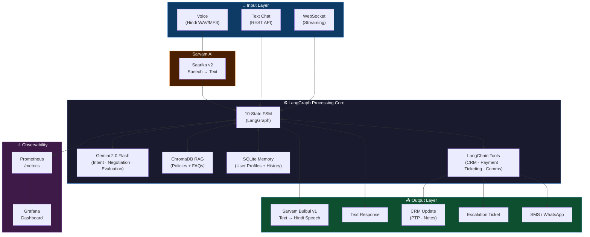
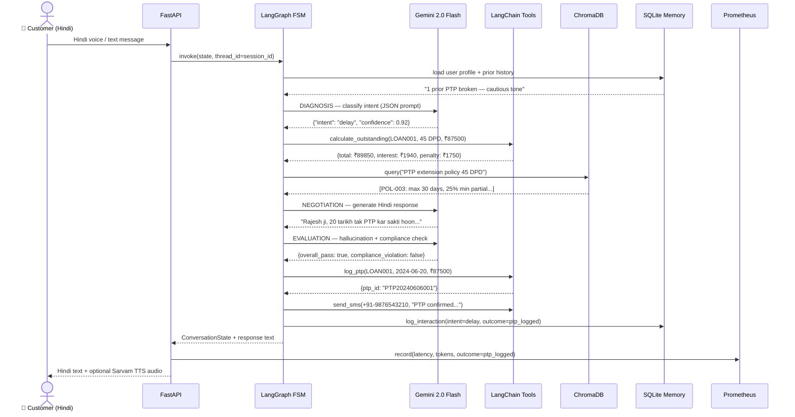
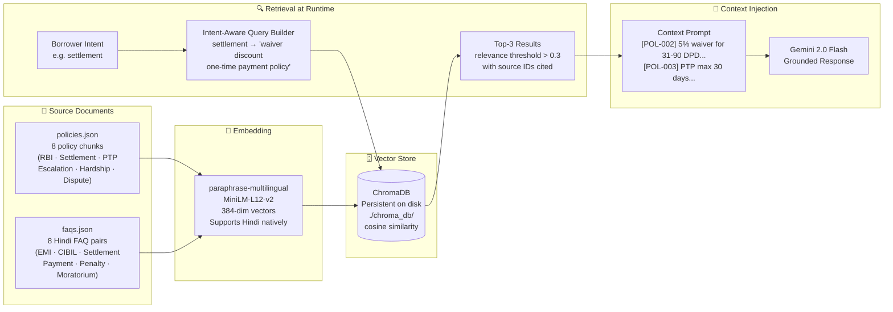
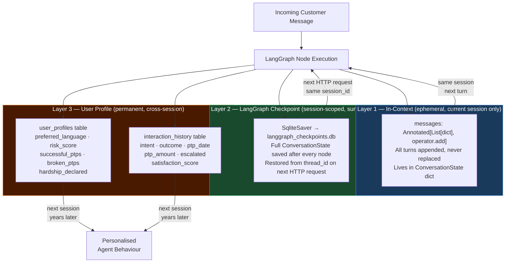
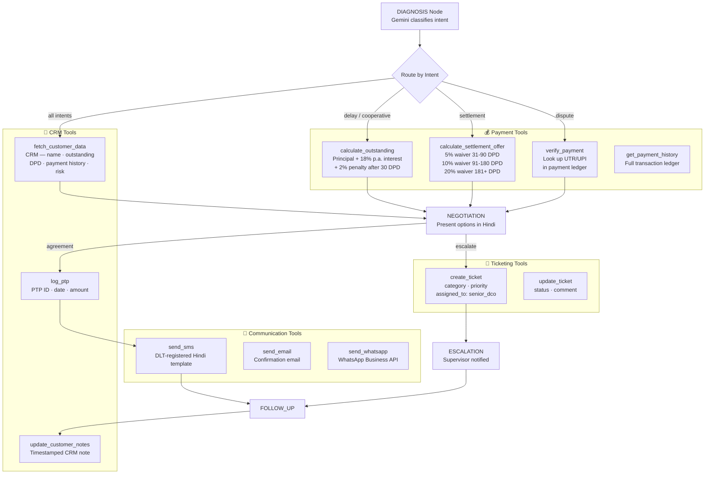

# System Architecture — CredResolve DCO Agent

## Full System Architecture

## Single-Call Data Flow

## RAG Pipeline

## Memory Architecture

## Tool Calling Flow

## Technology Stack

| Layer | Technology | Version | Role |
|-------|-----------|---------|------|
| Agent Framework | LangGraph | ≥0.1.0 | 10-state FSM + SQLite checkpointing |
| Orchestration | LangFlow | ≥1.0.0 | Visual workflow builder + JSON export |
| LLM | Gemini 2.5 Flash | gemini-2.5-flash | Reasoning + Hindi generation + thinking (free tier, GA June 2026) |
| LLM (lite) | Gemini 2.5 Flash-Lite | gemini-2.5-flash-lite | Low-latency fast responses, minimal cost |
| Vector Store | ChromaDB | ≥0.5.0 | Persistent cosine similarity search |
| Embeddings | MiniLM-L12-v2 | sentence-transformers | Multilingual Hindi-capable embeddings |
| Voice STT | Sarvam Saarika v2 | API | Hindi speech-to-text |
| Voice TTS | Sarvam Bulbul v1 | API | Hindi text-to-speech |
| Voice TTS (alt) | ElevenLabs multilingual v2 | API | Higher expressiveness fallback |
| Backend | FastAPI | ≥0.111.0 | REST + WebSocket + async |
| Memory (user) | SQLite + SQLAlchemy | built-in | Cross-session user profiles |
| Memory (graph) | LangGraph SqliteSaver | built-in | Per-session state checkpointing |
| Monitoring | Prometheus + Grafana | latest | 15 metrics + dashboards |
| Deployment | Docker Compose | latest | API + Prometheus + Grafana |
