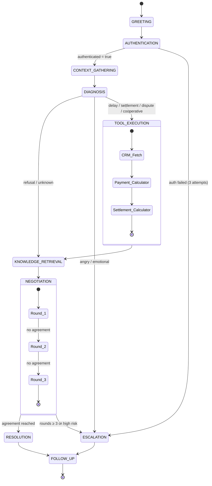
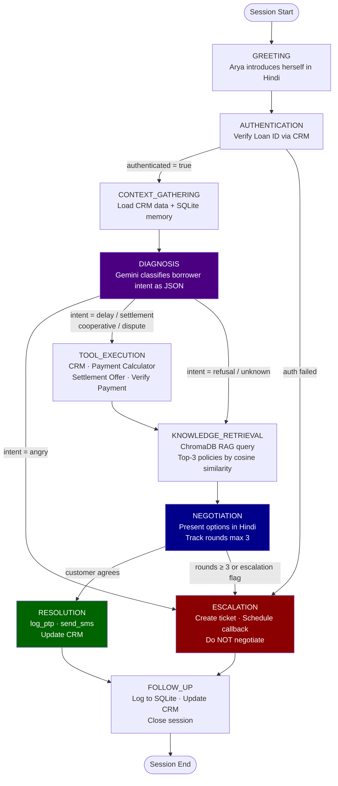

# Part 1: State Machine Design — CredResolve DCO Agent

## State Diagram

## Routing Logic Diagram

## State Reference Table

| # | State | Entry Condition | Key Actions | Tools Called | Exit Condition | Failure Path |
|---|-------|----------------|-------------|-------------|----------------|-------------|
| 1 | **GREETING** | New session started | Introduce Arya in Hindi | — | Greeting delivered | → END |
| 2 | **AUTHENTICATION** | Greeting done | Request Loan ID; verify via CRM | `fetch_customer_data` | CRM record found | → ESCALATION after 3 failures |
| 3 | **CONTEXT_GATHERING** | `authenticated=True` | Load CRM profile; fetch SQLite memory summary | `fetch_customer_data` | Customer data loaded | Proceed with minimal context |
| 4 | **DIAGNOSIS** | Context loaded; customer spoke | LLM classifies intent via structured JSON prompt | — | Intent + confidence returned | → NEGOTIATION with `unknown` |
| 5 | **TOOL_EXECUTION** | Intent ∈ {delay, settlement, dispute, cooperative} | Call payment/CRM/verification tools based on intent | `calculate_outstanding` · `calculate_settlement_offer` · `verify_payment` | Tool results returned | → ESCALATION |
| 6 | **KNOWLEDGE_RETRIEVAL** | Tools done (or direct from DIAGNOSIS) | RAG query to ChromaDB; intent-aware query string | ChromaDB | ≥1 doc with relevance > 0.3 | Proceed with empty policies |
| 7 | **NEGOTIATION** | Policies retrieved | Present Hindi options; track round count (max 3) | — | Agreement OR round limit | → ESCALATION |
| 8 | **ESCALATION** | intent=angry OR auth fail OR DPD>90 + refusal | Create ticket; schedule callback; notify supervisor | `create_ticket` · `send_sms` | Ticket created | → FOLLOW_UP |
| 9 | **RESOLUTION** | Customer agrees to PTP or settlement | Log PTP in CRM; send SMS confirmation | `log_ptp` · `send_sms` | PTP/settlement logged | → ESCALATION |
| 10 | **FOLLOW_UP** | Resolution or escalation complete | Write to SQLite; update CRM notes; close session | `update_customer_notes` | Session ends | → END |

## Transition Table

| From | Condition | To |
|------|-----------|-----|
| START | Session initiated | GREETING |
| GREETING | Always | AUTHENTICATION |
| AUTHENTICATION | `authenticated=True` | CONTEXT_GATHERING |
| AUTHENTICATION | `authenticated=False` | ESCALATION |
| CONTEXT_GATHERING | Always | DIAGNOSIS |
| DIAGNOSIS | `intent=angry` | ESCALATION |
| DIAGNOSIS | `intent ∈ {delay, settlement, dispute, cooperative}` | TOOL_EXECUTION |
| DIAGNOSIS | `intent ∈ {refusal, unknown}` | KNOWLEDGE_RETRIEVAL |
| TOOL_EXECUTION | Always | KNOWLEDGE_RETRIEVAL |
| KNOWLEDGE_RETRIEVAL | Always | NEGOTIATION |
| NEGOTIATION | Agreement reached | RESOLUTION |
| NEGOTIATION | `escalation_required=True` OR rounds ≥ 3 | ESCALATION |
| RESOLUTION | Always | FOLLOW_UP |
| ESCALATION | Always | FOLLOW_UP |
| FOLLOW_UP | Always | END |
